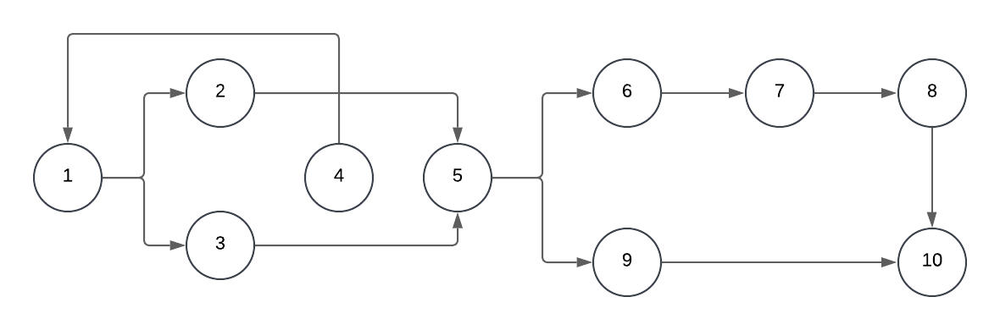

# AF_UI_UX
REAMD.ME - ERRO DO CODIGO APRESENTADO
Correção de Código 
Este projeto contém uma classe Java destinada a realizar a autenticação de usuários por meio de uma conexão com um banco de dados MySQL. Durante a análise do código original, foram encontrados diversos problemas relacionados à sintaxe e boas práticas. Este documento descreve os erros identificados, suas causas e as respectivas correções aplicadas.

Erros Encontrados e Soluções
1. Nome da Classe
Erro: O nome da classe foi definido com letras minúsculas (user), o que não segue as convenções de nomenclatura do Java.
Correção: Alterado para User (nomes de classes devem começar com letra maiúscula).
2. Driver MySQL
Erro: O driver utilizado estava incorreto: com.mysql.Driver.Manager. O correto é com.mysql.cj.jdbc.Driver.
Correção: Atualizado para com.mysql.cj.jdbc.Driver, que é o driver moderno recomendado para conexões MySQL em Java.
3. Conexão Não Declarada
Erro: A variável conn não foi declarada antes de ser utilizada em conectarBD.
Correção: Declarada a variável no escopo correto:
Connection conn = null;
4. SQL Injection
Erro: A construção manual da query com concatenação de strings era vulnerável a ataques de SQL Injection.
Correção: Implementado o uso de Prepared Statements, que tratam os parâmetros de forma segura.
5. Erro no Retorno do Método
Erro: A variável de retorno results foi escrita incorretamente (o correto seria result).
Correção: Ajustado para retornar a variável correta:
return result;
6. Tratamento de Exceções
Erro:
Exceções estavam sendo ignoradas nos blocos try-catch.
Uso de exception com letra minúscula (correto: Exception).
Correção:
Alterado para capturar e exibir mensagens de erro no console com e.printStackTrace().

caminhos
 4-1-2-5-6-7-8-10
 4-1-3-5-6-7-8-10
 4-1-2-5-9-10
 4-1-3-5-9-10

 M = E - N + 2P
 Nós = 10
 Arestas = 11
 M = 11 - 10 + 2.2
 M= 3